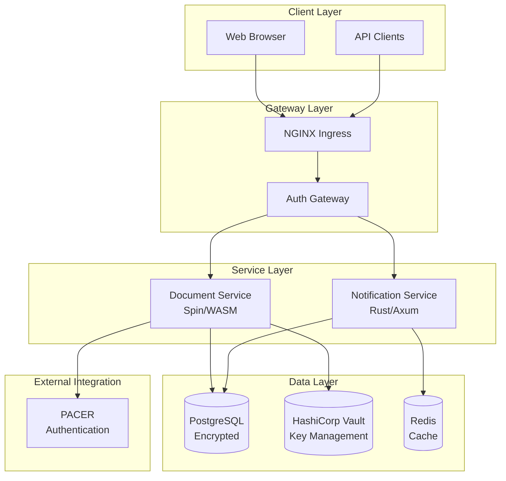

# Platform Migration: Monolith to Microservices

🎯 **Mission**: Gradual migration from monolith to microservices starting with secure document storage and notifications for federal judiciary compliance.

[](https://github.com/randallard/platform-migration/actions/workflows/ci.yml)
[](https://github.com/randallard/platform-migration/actions/workflows/security.yml)
[](./docs/compliance/fisma.md)
[](./docs/compliance/nist-controls.md)

## 🚀 Quick Start

```bash
# Clone the repository
git clone https://github.com/randallard/platform-migration.git
cd platform-migration

# Setup development environment (requires Nix)
nix develop

# Start local infrastructure
./scripts/local-dev/start-infrastructure.sh

# Start document service
cd services/document-service
spin build && spin up
```

**Ready in 5 minutes!** See the [Quick Start Guide](./docs/deployment/quick-start.md) for detailed instructions.

## 🏗️ Architecture

### Current Implementation (Phase 1)
- **✅ Document Service**: Spin/WASM with PostgreSQL encryption
- **✅ Notification Service**: Rust/Axum with event-driven architecture
- **✅ PACER Integration**: OAuth 2.0 with MFA support
- **✅ Security**: AES-256-GCM encryption, audit logging
- **✅ Deployment**: Kubernetes with ArgoCD GitOps

### Future Phases
- **📅 Phase 2**: Enhanced search, versioning, performance optimization
- **📅 Phase 3**: Hybrid architecture with object storage
- **📅 Phase 4**: Full microservices with service mesh



## 📊 Services

### Document Service (Spin/WASM)
- **🔐 Secure Storage**: AES-256-GCM encryption with envelope encryption
- **⚖️ PACER Integration**: Federal court system authentication
- **📝 Audit Logging**: Complete audit trail for compliance
- **🔍 File Validation**: Security scanning and type validation

**API Endpoints:**
```
POST   /api/v1/documents     # Upload document
GET    /api/v1/documents/:id # Retrieve document
DELETE /api/v1/documents/:id # Delete document
GET    /api/v1/search        # Search documents
GET    /health               # Health check
```

### Notification Service (Rust/Axum)
- **📧 Email Notifications**: Template-based email system
- **🔗 Webhook Delivery**: External system integration
- **📞 Event Processing**: Real-time document event handling
- **🔄 Retry Logic**: Reliable delivery with exponential backoff

**API Endpoints:**
```
POST   /notifications        # Create notification
GET    /notifications        # List notifications
POST   /notifications/:id/send # Send notification
POST   /webhooks             # Webhook endpoint
GET    /templates            # Notification templates
```

## 🔐 Security & Compliance

### Federal Compliance
- **✅ FISMA**: Federal Information Security Management Act
- **✅ NIST SP 800-53**: Security controls implementation
- **✅ CM/ECF**: Case Management/Electronic Case Files integration
- **✅ PACER**: Public Access to Court Electronic Records

### Security Features
- **🔒 Encryption**: AES-256-GCM for data at rest, TLS 1.3 in transit
- **🔐 Key Management**: HashiCorp Vault with envelope encryption
- **👤 Authentication**: PACER OAuth 2.0 with MFA support
- **📊 Audit Logging**: Complete audit trail with pgAudit
- **🛡️ Access Control**: Role-based access control (RBAC)

### Compliance Verification
```bash
# Run compliance checks
./scripts/compliance/check-fisma-controls.sh
./scripts/compliance/verify-nist-controls.sh
./scripts/compliance/generate-report.sh
```

## 🚦 Deployment

### Local Development
```bash
# Start infrastructure
./scripts/local-dev/start-infrastructure.sh

# Available services:
# - PostgreSQL: localhost:5432
# - Redis: localhost:6379
# - Vault: localhost:8200
# - Document Service: localhost:3000
# - Notification Service: localhost:3001
```

### Kubernetes Deployment
```bash
# Install platform components
./scripts/setup/install-platform.sh

# Deploy services
kubectl apply -k deployments/base/

# Check deployment status
kubectl get pods -n document-system
```

### GitOps with ArgoCD
- **🔄 Automated Deployment**: Git-based deployment automation
- **🔙 Easy Rollback**: One-click rollback capabilities
- **📊 Deployment Monitoring**: Real-time deployment status
- **🔀 Multi-Environment**: Dev, staging, production environments

## 🧪 Testing

### Run All Tests
```bash
# Comprehensive test suite
./scripts/test/run-all-tests.sh

# Individual service tests
cd services/document-service && cargo test
cd services/notification-service && cargo test
```

### Test Coverage
- **✅ Unit Tests**: Comprehensive unit test coverage
- **✅ Integration Tests**: End-to-end integration testing
- **✅ Security Tests**: Security vulnerability scanning
- **✅ Compliance Tests**: FISMA/NIST compliance verification
- **✅ Performance Tests**: Load and stress testing

## 📈 Monitoring & Observability

### Monitoring Stack
- **📊 Prometheus**: Metrics collection and storage
- **📈 Grafana**: Visualization dashboards
- **🔍 Jaeger**: Distributed tracing
- **📋 Alertmanager**: Intelligent alerting

### Key Metrics
- **🚀 Performance**: Response times, throughput, error rates
- **🔐 Security**: Authentication events, access violations
- **📊 Business**: Document operations, user activity
- **🖥️ Infrastructure**: Resource utilization, health status

## 🗄️ Database Design

### PostgreSQL Schema
```sql
-- Documents with encryption
CREATE TABLE documents (
    id UUID PRIMARY KEY DEFAULT gen_random_uuid(),
    case_number TEXT NOT NULL,
    content_encrypted BYTEA NOT NULL,
    encryption_key_id TEXT NOT NULL,
    created_by TEXT NOT NULL,
    created_at TIMESTAMPTZ DEFAULT NOW()
);

-- Comprehensive audit logging
CREATE TABLE document_access_log (
    id UUID PRIMARY KEY DEFAULT gen_random_uuid(),
    document_id UUID REFERENCES documents(id),
    user_id TEXT NOT NULL,
    action TEXT NOT NULL,
    ip_address INET,
    accessed_at TIMESTAMPTZ DEFAULT NOW()
);
```

### Data Protection
- **🔒 Encryption at Rest**: pgcrypto with AES-256
- **🔐 Key Management**: HashiCorp Vault integration
- **📊 Audit Trail**: Complete access logging
- **🔄 Backup Strategy**: Automated encrypted backups

## 🔄 Migration Strategy

### Phase 1: Foundation (Current - 3 months)
- ✅ **Document Storage**: PostgreSQL with encryption
- ✅ **PACER Authentication**: OAuth 2.0 integration
- ✅ **Basic Notifications**: Email and webhook system
- ✅ **Kubernetes Deployment**: Production-ready infrastructure

### Phase 2: Enhancement (Next 3 months)
- 🔄 **Advanced Search**: Full-text search capabilities
- 🔄 **Document Versioning**: Version control system
- 🔄 **Batch Processing**: Bulk operations support
- 🔄 **Performance Optimization**: Caching and optimization

### Phase 3: Hybrid Architecture (6 months)
- 📋 **Object Storage**: S3/MinIO integration
- 📋 **CDN Integration**: Content delivery network
- 📋 **Advanced Caching**: Multi-layer caching strategy
- 📋 **Multi-Region Support**: Geographic distribution

### Phase 4: Full Microservices (12 months)
- 📋 **Service Mesh**: Istio/Linkerd implementation
- 📋 **Additional Services**: Case management, user management
- 📋 **Machine Learning**: Document classification and analysis
- 📋 **Advanced Analytics**: Business intelligence and reporting

## 📚 Documentation

### Architecture Documentation
- [System Architecture](./docs/architecture/system-architecture.md)
- [Security Architecture](./docs/architecture/security-architecture.md)
- [Database Design](./docs/architecture/database-design.md)
- [Service Boundaries](./docs/architecture/service-boundaries.md)

### Deployment Documentation
- [Quick Start Guide](./docs/deployment/quick-start.md)
- [Local Development](./docs/deployment/local-development.md)
- [Kubernetes Deployment](./docs/deployment/kubernetes.md)
- [Production Checklist](./docs/deployment/production-checklist.md)

### Compliance Documentation
- [FISMA Compliance](./docs/compliance/fisma.md)
- [NIST Controls](./docs/compliance/nist-controls.md)
- [PACER Integration](./docs/compliance/pacer-integration.md)
- [Audit Procedures](./docs/compliance/audit-procedures.md)

### API Documentation
- [Document Service API](./docs/api/document-service.md)
- [Notification Service API](./docs/api/notification-service.md)
- [Authentication API](./docs/api/authentication.md)

## 🤝 Contributing

We welcome contributions! Please see our [Contributing Guide](./CONTRIBUTING.md) for details.

### Development Workflow
1. **Fork the repository**
2. **Create a feature branch** (`git checkout -b feature/amazing-feature`)
3. **Run tests** (`./scripts/test/run-all-tests.sh`)
4. **Commit changes** (`git commit -m 'Add amazing feature'`)
5. **Push to branch** (`git push origin feature/amazing-feature`)
6. **Open a Pull Request**

### Code Style
- **Rust**: Follow `rustfmt` and `clippy` standards
- **Documentation**: Include comprehensive inline documentation
- **Testing**: Write tests for all new functionality
- **Security**: Follow security best practices

## 📊 Project Status

### ✅ Completed
- [x] Core architecture design and documentation
- [x] Document service with Spin/WASM
- [x] Notification service with Rust/Axum
- [x] PostgreSQL database with encryption
- [x] PACER authentication integration
- [x] Kubernetes deployment manifests
- [x] ArgoCD GitOps configuration
- [x] FISMA/NIST compliance framework
- [x] Comprehensive test suites
- [x] CI/CD pipeline with GitHub Actions

### 🔄 In Progress
- [ ] Advanced search capabilities
- [ ] Document versioning system
- [ ] Performance optimization
- [ ] Enhanced monitoring and alerting
- [ ] Advanced security features

### 📋 Planned
- [ ] Object storage integration
- [ ] Service mesh implementation
- [ ] Machine learning features
- [ ] Advanced analytics
- [ ] Multi-region deployment

## 🆘 Support

### Getting Help
- **📖 Documentation**: Browse the [docs](./docs/) folder
- **🐛 Issues**: Open an issue on [GitHub](https://github.com/randallard/platform-migration/issues)
- **💬 Discussions**: Join [GitHub Discussions](https://github.com/randallard/platform-migration/discussions)
- **🔧 Troubleshooting**: Check the [troubleshooting guide](./docs/operations/troubleshooting.md)

### Community
- **👥 Contributors**: See our [contributors](./CONTRIBUTORS.md)
- **📧 Contact**: Reach out to the maintainers
- **🔐 Security**: Report security issues via [security@example.com](mailto:security@example.com)

## 📄 License

This project is licensed under the MIT License - see the [LICENSE](LICENSE) file for details.

## 🙏 Acknowledgments

- **Fermyon Spin**: WebAssembly serverless framework
- **HashiCorp Vault**: Secrets management
- **PostgreSQL**: Database with encryption extensions
- **Kubernetes**: Container orchestration
- **ArgoCD**: GitOps deployment
- **PACER**: Federal court system integration

---

**Built with ❤️ for secure, compliant, and gradual migration from monolith to microservices**

*Ready to start your migration journey? Check out our [Quick Start Guide](./docs/deployment/quick-start.md)!*